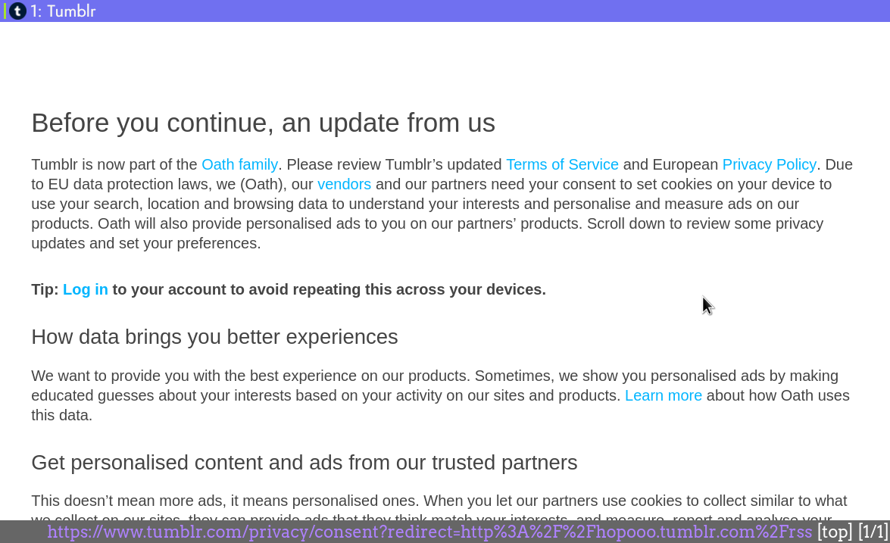

Title: Workaround for newsboat not able to access Tumblr RSS feed
Date: 2018-08-07 12:15
Modified: 2018-08-07 12:15
Category: programs
Tags: newsboat, Tumblr, RSS
Slug: workaround-newsboat-tumblr
Authors: Hendrik Rosendahl
Summary: A configuration workaround for Tumblr's GDPR notice in their RSS feed for newsboat

Recently [newsboat](https://newsboat.org/) displayed the following error while retrieving news from a Tumblr RSS feed:
```
Error while retrieving http://hopooo.tumblr.com/rss: unsupported feed format
```
going to that URL in my browser showed a notice about the new GDPR rules and a button to accept those new terms:



Accepting the notice forwards you to the actual RSS feed.
Further inspection shows that Tumblr sets a cookie, that I accepted the GDPR notice and does not show it in subsequent visits, **but** the RSS reader newsboat does not handle cookies.

A workaround was posted for another RSS reader on their [GitHub page](https://github.com/miniflux/miniflux/issues/140#issuecomment-408366528), there it is noted, that if the user agent contains the word *Googlebot*, then Tumblr does not show the GDPR notice anymore.

This is what I tried and it actually works by just setting

```
user-agent "Googlebot"
```

in your `$XDG_CONFIG_HOME/newsboat/config` file (which is `~/.config/newsboat/config` for the most people), or if you do not follow the [XDG basedir standard](https://standards.freedesktop.org/basedir-spec/basedir-spec-latest.html) then the `~/.newsboat/config` file.
